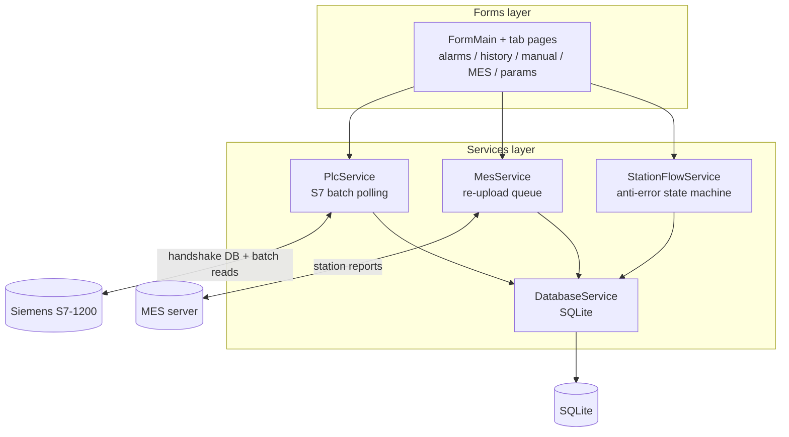

[中文](README.md) | **English**

   

# C# Industrial HMI Framework (Siemens PLC + MES + SQLite)

> 从真实产线电子检具项目完整脱敏出来的上位机框架，中文注释齐全。A WinForms HMI framework from a real production line: 300-point S7 batch polling, station anti-error state machine, MES offline re-upload queue, and a no-hardware simulation mode. All dependencies are NuGet packages — restore and build, no binary DLLs.

## What problems it solves

| Common field problem | How this code handles it |
|---|---|
| No PLC on your desk, can't develop | Built-in simulation mode: the full UI and business flow run without PLC or MES |
| 300+ tags polled one by one choke the S7-1200 | `BuildReadPlan()` merges tags into a few batch reads at startup (a pitfall hit on a real line) |
| One network hiccup to MES loses records | Offline re-upload queue refills station data automatically once the link is back |
| Every new product variant means code changes | Tags and tolerances live in JSON configs; on-screen overlay is editable and draggable |

## Architecture

Three layers, dependencies flow one way only:



How the PLC handshake works, how the state machine flows, how read plans get merged — `设计说明.md` walks through all of it against the code (in Chinese). Read it before refactoring.

## Repository layout

```
.
├── README.md / README.en.md
├── 设计说明.md           # tag table / read plan / state machine / handshake protocol
└── src/
    ├── GaugeDemo.sln / GaugeDemo.csproj   # opens in VS2019+
    ├── App.config / Program.cs / S7Var.cs # S7Var: parses DB1.DBD0 / M100.0 style addresses
    ├── Forms/            # FormMain, FrmLogin, UcPage tab controls
    ├── Models/           # ProductModel, SystemConfig, PointConfig, …
    ├── Services/         # PlcService, MesService, DatabaseService, StationFlowService, …
    └── Properties/
```

## Build & run

1. Open `src/GaugeDemo.sln` in VS2019+, let NuGet restore, build — nothing manual;
2. Simulation mode is the default: press F5 and click through every page without any hardware;
3. For a real line, change the PLC IP and MES address in `Config\SystemConfig.json`; tag configs live in the same folder.

## FAQ

- **Which PLCs?** Siemens S7-1200 (Ethernet PROFINET, S7netplus 0.20). Address parsing is in `S7Var.cs` — `DB1.DBD0`, `DB1.DBX4.0`, `M100.0` all work.
- **How do I add tags?** JSON config + per-model parameter sets; the three tag classes (result / measurement / cylinder) are tabulated in section 1 of `设计说明.md`.
- **What's the MES interface?** Plain HTTP POST with JSON. The reconnect and re-upload logic in MesService is self-contained — point it at your own endpoint.
- **Commercial use?** This is sanitized engineering code; customize freely. The full version ships a customization guide and commercial license terms.

## About the full version

This repo is the showcase edition. The full version adds a 62-page per-module walkthrough, CHANGELOG, 10-minute quickstart and an FAQ document. It's being listed on mianbaoduo and CSDN:

- CSDN posts (Chinese, more coming): [Hikvision camera connection troubleshooting] (https://blog.csdn.net/csdngouwei/article/details/166601561)
- Mianbaoduo full package: link will be added once listed, or ask via CSDN private message
