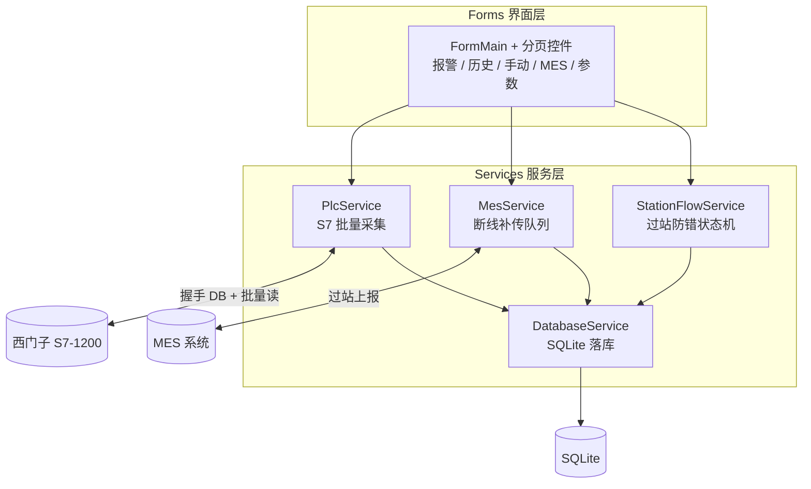

**中文** | [English](README.en.md)

   

# C# 工控上位机通讯框架（西门子 PLC + MES + SQLite）

> A C# WinForms HMI framework from a real production line: 300-point S7 batch polling, station anti-error state machine, MES offline re-upload queue, and a no-hardware simulation mode. Runs out of the box after NuGet restore.

从真实产线电子检具项目完整脱敏出来的上位机框架：300 点位 S7 批量采集、过站防错状态机、MES 断线补传、无硬件模拟降级。依赖全是 NuGet 包，还原即可编译，没有二进制 DLL。

## 这套框架解决什么问题

| 现场常见问题 | 这套代码的做法 |
|---|---|
| 手里没有 PLC，没法开发调试 | 内置模拟降级：不接 PLC / MES 也能把界面和业务流程完整走通 |
| 300+ 点位逐点读，S7-1200 通讯直接卡死 | 启动时 `BuildReadPlan()` 把点位合并成少量批量读（这是现场真实踩过的坑） |
| MES 网络一抖就丢单 | 断线补传队列，网络恢复后自动补齐过站数据 |
| 换个机型就要改代码 | 点位、公差全在 JSON 配置里维护，界面点位叠加可编辑可拖拽 |

## 架构

三层结构，依赖只朝一个方向走，改哪层都不牵连别层：



PLC 和上位机怎么握手、状态机怎么流转、读取计划怎么合并，`设计说明.md` 里按代码逐条讲了一遍，二次开发前建议先读它。

## 目录结构

```
.
├── README.md / README.en.md
├── 设计说明.md           # 点位表 / 读取计划 / 过站状态机 / 握手协议，从代码反推
└── src/
    ├── GaugeDemo.sln / GaugeDemo.csproj   # VS2019+ 直接打开
    ├── App.config / Program.cs / S7Var.cs # S7Var：DB1.DBD0 / M100.0 这类地址的解析器
    ├── Forms/            # FormMain、FrmLogin、UcPage 系列分页控件
    ├── Models/           # ProductModel、SystemConfig、PointConfig 等
    ├── Services/         # PlcService、MesService、DatabaseService、StationFlowService 等
    └── Properties/
```

## 编译运行

1. VS2019 及以上打开 `src/GaugeDemo.sln`，NuGet 还原后编译，零手动配置；
2. 默认就是模拟模式，F5 直接跑，没有 PLC 也能点遍所有界面流程；
3. 接真机时在 `Config\SystemConfig.json` 里改 PLC IP 和 MES 地址，点位表同目录维护。

## 常见问题

- **支持哪些 PLC？** 西门子 S7-1200（以太网 PROFINET，S7netplus 0.20）。地址解析在 `S7Var.cs`，`DB1.DBD0`、`DB1.DBX4.0`、`M100.0` 这类写法都认。
- **点位怎么加？** JSON 配置文件 + 型号参数组，三类点位（结果点 / 测量点 / 气缸）的字段定义见 `设计说明.md` 第 1 节的表。
- **MES 对接什么接口？** HttpClient + JSON 的通用 POST，MesService 里断线重连和补传队列的逻辑独立成段，套你们自己的接口地址就能用。
- **能商用吗？** 这是脱敏后的工程代码，二次开发随意；完整版附二次开发指南和商用授权说明。

## 关于完整版

这个仓库是展示版。完整版补齐 62 页逐模块讲解、CHANGELOG、10 分钟上手指南和常见问题文档，在面包多和 CSDN 上架中——需要可以先在 CSDN 蹲一下：

- CSDN 博文（陆续更新中）：[海康相机连接故障排查实战](https://blog.csdn.net/csdngouwei/article/details/166601561)
- 面包多完整包：上架后在这里补链接，或 CSDN 私信询问
